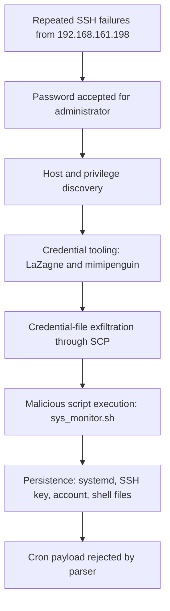
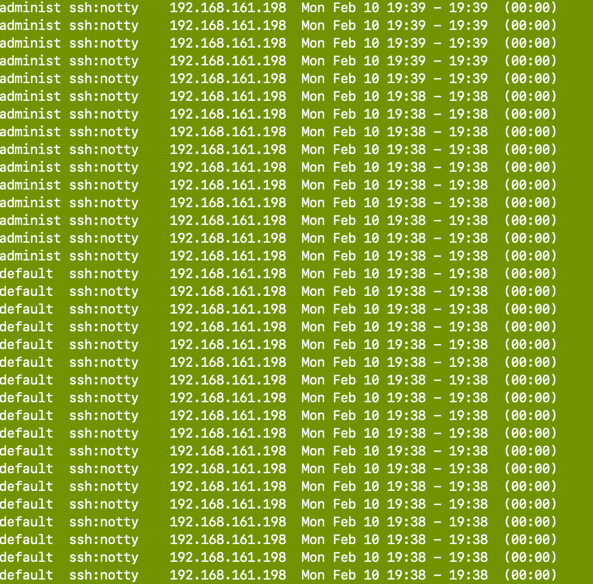
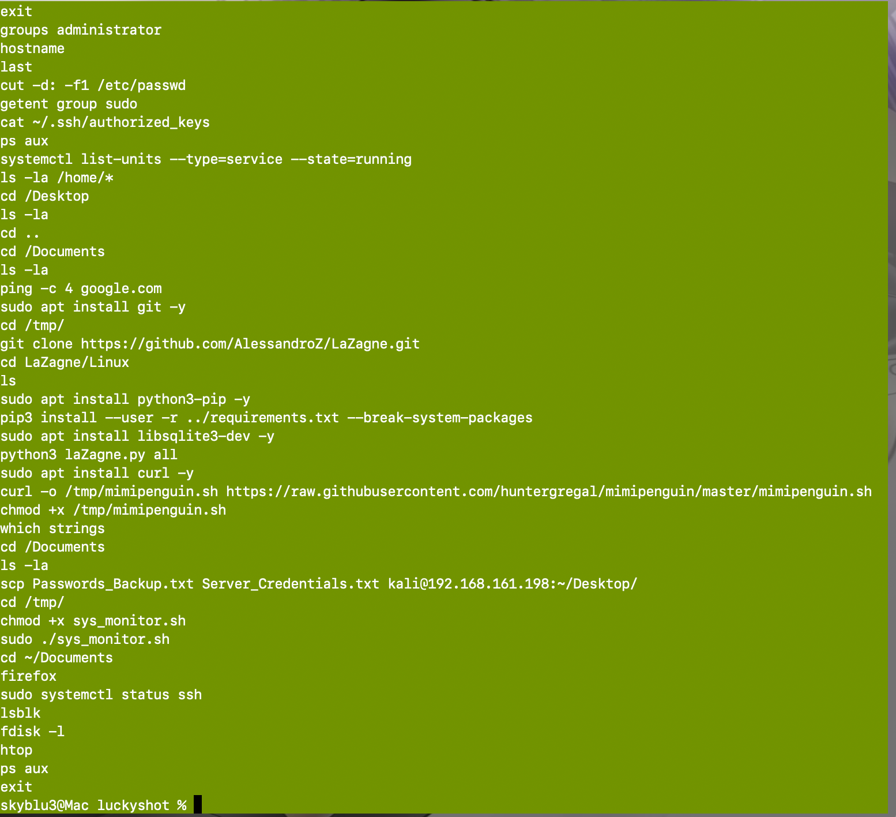
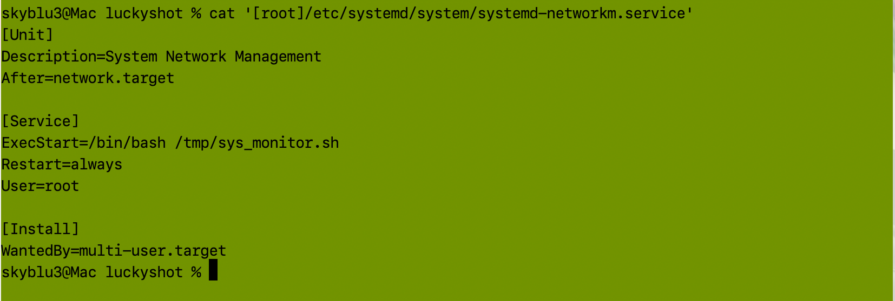
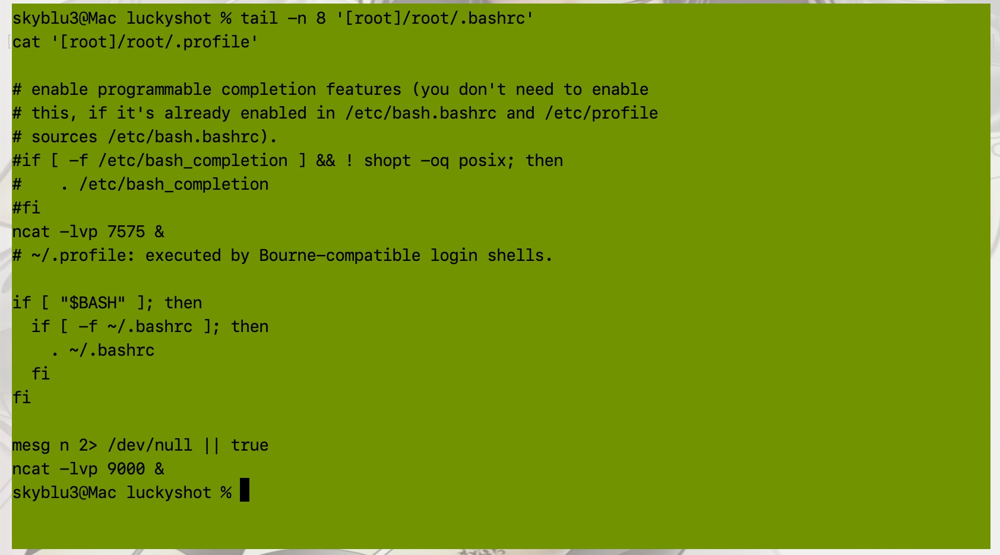
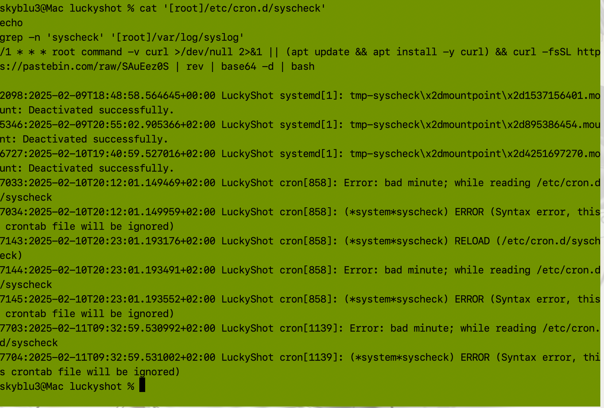

# LuckyShot: Linux Endpoint Compromise Investigation

> **Publication hold:** This draft contains Hack The Box Sherlock spoilers. 

## Executive Summary

This project documents a simulated digital forensics and incident response investigation of a compromised Linux workstation. The user reported missing and modified company files. I analyzed live-response output, authentication logs, login records, shell history, file hashes, systemd units, SSH configuration, shell startup files, and cron artifacts to reconstruct the intrusion.

The evidence supports a brute-force/credential-guessing attack against SSH from `192.168.161.198`. After repeated failures against several usernames, the source successfully authenticated as `administrator` at `2025-02-10T19:39:03.232692+02:00`.

Post-compromise activity included:

- Local account and privilege discovery
- Download and use of credential-recovery tooling
- Exfiltration of credential files through SCP
- Execution of `sys_monitor.sh`
- Root-level persistence through a deceptive systemd service
- An attacker-supplied SSH authorized key
- Creation of a privileged local account
- Shell-startup persistence using network listeners
- An attempted cron-based payload fetch that failed because the cron syntax was invalid

The strongest part of this investigation was not a single command. It was correcting the working theory as better evidence became available.

## Attack Path

## Investigation Approach

1. **Triage the collection.** I reviewed the live-response categories and prioritized login, process, network, and system artifacts.
2. **Test the first hypothesis.** USB inventory contained only VMware virtual devices and Linux root hubs, so removable-media access was not supported.
3. **Identify the access path.** `lastb` output showed repeated SSH failures from one source against several usernames.
4. **Establish the first successful login.** The summarized `last` output pointed to `19:41`, but `auth.log` revealed an earlier accepted password at `19:39:03`.
5. **Reconstruct attacker actions.** The compromised user's Bash history showed reconnaissance, tool transfer, credential access, SCP exfiltration, and script execution.
6. **Validate persistence.** I correlated systemd configuration, service logs, SSH keys, account-creation records, shell startup artifacts, and cron files.
7. **Check whether persistence actually worked.** Syslog showed that the malicious cron definition had a bad minute field and was ignored.

## Key Findings

| Finding | Evidence | Assessment |
| --- | --- | --- |
| Initial access | Repeated failed SSH logins followed by `Accepted password` from the same IP | High confidence |
| Compromised account | `administrator` | High confidence |
| First successful authentication | `2025-02-10T19:39:03.232692+02:00` | High confidence |
| Source and exfiltration destination | `192.168.161.198` | High confidence |
| Privilege check | `groups administrator` | High confidence |
| Credential tooling | LaZagne was cloned and run; a second Linux credential script was downloaded | High confidence |
| File exfiltration | `Passwords_Backup.txt` and `Server_Credentials.txt` transferred with SCP | High confidence |
| Malicious script | `sys_monitor.sh` | High confidence |
| Script SHA-1 | `3ae5dea716a4f7bfb18046bfba0553ea01021c75` | Strong association; recovered from an inventory path that differs from the execution path |
| Systemd persistence | `systemd-networkm.service` ran `/tmp/sys_monitor.sh` as root | High confidence |
| Attacker identity clue | SSH key comment `kali@kali` | Corroborating clue, not real-world attribution |
| Persistence account | `Regev`, added to `sudo` and `adm` | High confidence |
| Account creation | `2025-02-10T20:11:21.783367+02:00` | High confidence |
| Scheduled payload | `/etc/cron.d/syscheck` fetched, reversed, decoded, and piped a Pastebin payload to Bash | Artifact confirmed |
| Scheduled execution | Cron rejected the file because of an invalid minute field | Confirmed failure |
| Shell-startup persistence | Root `.bashrc` and `.profile` configured Ncat listeners on ports `7575` and `9000` | High confidence in configuration; runtime listener state was not captured |

## Critical Timeline

| Time (`+02:00`) | Event |
| --- | --- |
| `2025-02-10 19:38-19:39` | Repeated failed SSH logins from `192.168.161.198` against multiple usernames |
| `2025-02-10 19:39:03.232692` | Password accepted for `administrator` |
| `2025-02-10 19:39:03.273657` | SSH session opened |
| `2025-02-10 19:41:10.248386` | A second password authentication succeeded from the same source |
| `2025-02-10 20:11:20.692742` | `systemd-networkm.service` started |
| `2025-02-10 20:11:21.731285` | Privileged `useradd` command invoked for `Regev` |
| `2025-02-10 20:11:21.783367` | The new local user was successfully created |
| `2025-02-10 20:12:01.149469` | Cron logged `bad minute` and ignored `/etc/cron.d/syscheck` |

## Evidence Highlights

### SSH credential attack

The failure history showed repeated SSH attempts from the same host against usernames including `administrator`, `admin`, `default`, `ubuntu`, and `root`.

### Post-compromise command history

The Bash history connected reconnaissance, tool download, credential access, SCP exfiltration, and malicious-script execution in one artifact.

### Deceptive root-level service

The attacker created `systemd-networkm.service`, a name resembling the legitimate `systemd-networkd` service. Its `ExecStart` directive launched `/tmp/sys_monitor.sh`, it ran as root, and it was configured to restart automatically.

### Root shell-startup persistence

Root's `.bashrc` and `.profile` were modified to start Ncat listeners. The `.bashrc` entry used the lower port, `7575`, while `.profile` used `9000`.

### Failed cron persistence

Finding a cron file did not prove execution. Syslog showed the definition was rejected as syntactically invalid.

## MITRE ATT&CK Summary

| Behavior | Technique |
| --- | --- |
| Repeated SSH password attempts | [T1110.001 - Password Guessing](https://attack.mitre.org/techniques/T1110/001/) |
| Remote access through SSH | [T1021.004 - SSH](https://attack.mitre.org/techniques/T1021/004/) |
| Stored-credential recovery | [T1555 - Credentials from Password Stores](https://attack.mitre.org/techniques/T1555/) |
| SCP exfiltration | [T1048.002 - Exfiltration Over Asymmetric Encrypted Non-C2 Protocol](https://attack.mitre.org/techniques/T1048/002/) |
| Root-level systemd service | [T1543.002 - Systemd Service](https://attack.mitre.org/techniques/T1543/002/) |
| Root SSH key | [T1098.004 - SSH Authorized Keys](https://attack.mitre.org/techniques/T1098/004/) |
| Privileged local account creation | [T1136.001 - Local Account](https://attack.mitre.org/techniques/T1136/001/) |
| Cron-based execution attempt | [T1053.003 - Cron](https://attack.mitre.org/techniques/T1053/003/) |
| Reversed and Base64-encoded payload | [T1140 - Deobfuscate/Decode Files or Information](https://attack.mitre.org/techniques/T1140/) |
| Access to `/etc/passwd` and `/etc/shadow` | [T1003.008 - `/etc/passwd` and `/etc/shadow`](https://attack.mitre.org/techniques/T1003/008/) |

See the [full ATT&CK mapping](docs/05-mitre-attack.md), including evidence and observed-versus-attempted status.

## Detection and Response Recommendations

- Alert when one source generates failed SSH logins across several usernames and then successfully authenticates.
- Prefer key-based SSH authentication, restrict source networks, disable direct root login, and add rate limiting or lockout controls.
- Monitor execution of `useradd`, especially when new accounts are placed in `sudo` or `adm`.
- Apply file-integrity monitoring to `/etc/systemd/system`, `/etc/cron.d`, `/root/.ssh/authorized_keys`, and root shell startup files.
- Alert on suspicious pipelines such as `curl | rev | base64 -d | bash`.
- Monitor outbound SCP and HTTP POST activity involving credential files or unusual destinations.
- Isolate the affected host, disable compromised and attacker-created accounts, remove unauthorized keys and persistence, rotate exposed credentials, and hunt for the same indicators across related systems.

## Repository Guide

| Path | Purpose |
| --- | --- |
| [docs/01-investigation.md](docs/01-investigation.md) | Full evidence-led narrative |
| [docs/02-troubleshooting.md](docs/02-troubleshooting.md) | Wrong turns, corrections, and validation |
| [docs/03-command-reference.md](docs/03-command-reference.md) | Commands used, organized by question |
| [docs/04-evidence-index.md](docs/04-evidence-index.md) | Screenshot provenance, meaning, and limitations |
| [docs/05-mitre-attack.md](docs/05-mitre-attack.md) | Detailed ATT&CK mapping |
| [docs/06-learning-next.md](docs/06-learning-next.md) | Focused follow-up syllabus |
| [docs/publishing-checklist.md](docs/publishing-checklist.md) | Pre-publication gate |
| [LINKEDIN-POST.md](LINKEDIN-POST.md) | Spoiler-light project announcement |

## Scope

This is a simulated training investigation based on the Hack The Box Sherlock **LuckyShot**. All systems, accounts, addresses, and activity described here belong to the lab scenario.
